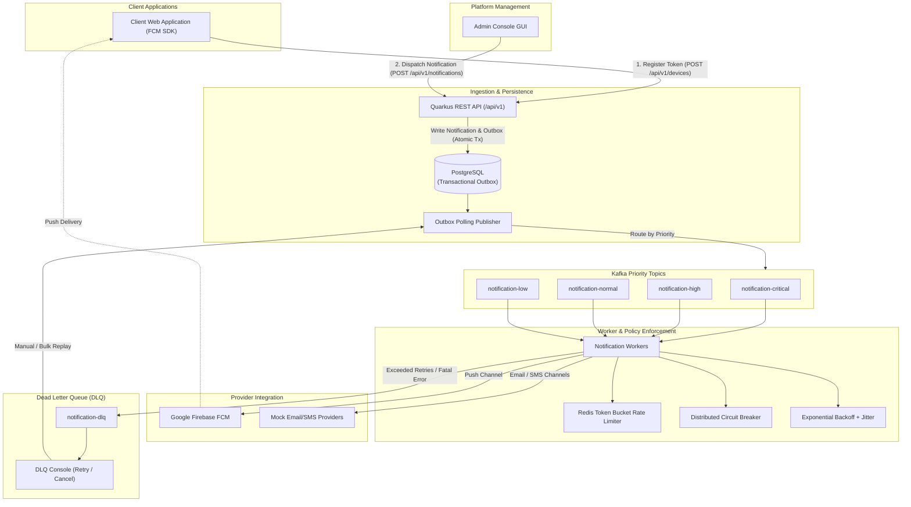

# High-Throughput Distributed Notification Platform

[](https://www.oracle.com/java/)
[](https://quarkus.io/)
[](https://kafka.apache.org/)
[](https://www.postgresql.org/)
[](https://redis.io/)
[](https://firebase.google.com/)

A resilient, event-driven, high-throughput notification platform engineered with **Java 21**, **Quarkus**, **Apache Kafka**, **PostgreSQL (Transactional Outbox)**, **Redis (Rate Limiting & Circuit Breaker)**, and **Google Firebase Cloud Messaging (FCM)**.

The platform is designed around a single administrative role (**Platform Admin / Operator**) who oversees the entire notification lifecycle—from message dispatching and priority scheduling to circuit breaking, rate limiting, and Dead Letter Queue (DLQ) self-healing.

---

## Architecture Overview



---

## Core Technical Features

### 1. Reliable Delivery via Transactional Outbox
* Guarantees **At-Least-Once delivery** without dual-write consistency issues.
* HTTP requests commit notification metadata and outbox records atomically into PostgreSQL before asynchronous Kafka publishing.

### 2. Multi-Priority Queuing with Apache Kafka
* Notifications are categorized into four priority levels: `CRITICAL`, `HIGH`, `NORMAL`, and `LOW`.
* Each priority maps to dedicated Kafka topics, ensuring high-urgency notifications bypass background or marketing traffic.

### 3. Distributed Rate Limiting (Redis Token Bucket)
* Protects downstream third-party APIs from being overwhelmed or rate-limited.
* Implemented using Redis for atomic, synchronized token consumption across distributed worker instances.

### 4. Distributed Circuit Breaker & Fail-Fast
* Monitors provider error rates over a sliding window.
* Automatically transitions to `OPEN` state upon consecutive failures, triggering **Fail-Fast in 0ms** to prevent worker thread exhaustion.
* Supports automatic `HALF-OPEN` probing and manual administrative reset.

### 5. Dead Letter Queue (DLQ) & Administrative Self-Healing
* Non-recoverable failures and notifications exceeding maximum retry attempts are isolated into the DLQ.
* Platform Admin can inspect, filter by channel, paginate, and execute single or bulk replay (`retry-all`) / cancellation (`cancel-all`).

### 6. Full End-to-End Observability
* Distributed tracing with **OpenTelemetry (Tempo)**.
* System and business metrics exported via **Prometheus** (`/q/metrics`).
* Pre-configured **Grafana** dashboards.

---

## System Workflow

| Step | Component | Action |
| :---: | :--- | :--- |
| **1** | **Client Web App** | Initializes Firebase Messaging SDK, requests browser notification permission, and registers its FCM token via `POST /api/v1/devices`. |
| **2** | **Admin Console** | Platform Admin crafts a notification targeting specific User IDs, device tokens, or `ALL` (broadcast). |
| **3** | **Ingestion & Outbox** | Backend records notification payload into PostgreSQL and Outbox table atomically (`202 Accepted`). |
| **4** | **Kafka & Workers** | Outbox publisher pushes messages to appropriate Kafka priority topics. Workers enforce Rate Limiting, Retry policies, and Circuit Breaker checks. |
| **5** | **Provider Delivery** | Worker invokes Google Firebase Cloud Messaging HTTP/v1 API with OAuth2 authentication. |
| **6** | **Client Presentation** | The browser client receives the push notification in foreground (`onMessage`) or background (Service Worker). |

---

## Technology Stack

* **Backend Framework:** [Quarkus 3.18](https://quarkus.io/) (RESTEasy Reactive, SmallRye Reactive Messaging, Hibernate ORM with Panache)
* **Language & Runtime:** Java 21 LTS
* **Database & Migration:** PostgreSQL 16, Liquibase
* **Event Streaming:** Apache Kafka, SmallRye Kafka Connector
* **Distributed State & Caching:** Redis 7 (Quarkus Redis Client)
* **Cloud Push Service:** Google Firebase Cloud Messaging (OAuth2 Service Account)
* **Observability:** OpenTelemetry, Micrometer, Prometheus, Grafana, Tempo
* **Frontend:** Responsive Vanilla HTML5/CSS3/JavaScript (Admin Console + Client Web Demo)

---

## Project Structure

```
.
├── src/main/java/com/notification
│   ├── api/                     # REST Controllers & JAX-RS Resources
│   │   ├── dto/                 # Request & Response Data Transfer Objects
│   │   ├── NotificationResource.java
│   │   ├── DeviceResource.java
│   │   ├── DlqResource.java
│   │   └── CircuitBreakerResource.java
│   ├── application/             # Core Services & Orchestration
│   ├── circuitbreaker/          # Distributed Circuit Breaker (Redis-backed)
│   ├── dlq/                     # Dead Letter Queue Consumer & Management
│   ├── domain/                  # JPA Entities (Notification, Device, Outbox)
│   ├── infrastructure/          # Database Repositories & Utilities
│   ├── outbox/                  # Transactional Outbox Polling Publisher
│   ├── provider/                # FCM & Mock Provider Integrations
│   ├── ratelimit/               # Distributed Token Bucket Rate Limiter
│   ├── retry/                   # Exponential Backoff with Jitter
│   └── worker/                  # Kafka Priority Consumers
├── src/main/resources
│   ├── application.properties   # Central Configuration
│   ├── db/changeLog.xml         # Liquibase Schema Migrations
│   └── META-INF/resources
│       ├── index.html           # Platform Admin Console
│       ├── client.html          # Minimalist Client Demo App
│       └── firebase-messaging-sw.js
├── docker-compose.yml           # Infrastructure Stack (Postgres, Kafka, Redis, Grafana, Tempo)
└── pom.xml                      # Maven Build Dependencies
```

---

## Getting Started

### Prerequisites
* **Java 21** or later
* **Maven 3.9+**
* **Docker & Docker Compose**

### 1. Start Infrastructure Services
```bash
docker-compose up -d
```
Verify that PostgreSQL (`5432`), Kafka (`9092`), and Redis (`6379`) are healthy.

### 2. Configure Firebase Credentials
Place your Google Cloud Firebase service account key at:
`src/main/resources/firebase-service-account.json`

Ensure your `application.properties` references your project ID:
```properties
quarkus.google.cloud.project-id=your-firebase-project-id
```

### 3. Run the Backend in Development Mode
```bash
mvn quarkus:dev
```
The server will start at `http://localhost:8080`.

---

## Microservices Deployment Mode (Multi-Container Architecture)

The platform can be decomposed and deployed as **3 independent microservices** running in isolated Docker containers:

1. **API Ingestion Service (`notification-api`)**: Handles external REST traffic, validation, device registry, and writes to the Transactional Outbox (Port `8080`).
2. **Outbox Publisher Service (`notification-outbox`)**: Dedicated background polling publisher dispatching due events to Kafka priority topics (Port `8082`).
3. **Notification Worker Service (`notification-worker`)**: Subscribes to Kafka priority queues, executes Token Bucket rate limiting, Circuit Breaker checks, and calls providers (Port `8083`). **Horizontally scalable.**

### Launching Microservices Stack:
```bash
./start-microservices.sh
```

### Scale Worker Service Independently:
```bash
docker compose -f docker-compose.microservices.yml up -d --scale notification-worker=3
```

---

## User Interfaces

### 1. Platform Admin Console (`http://localhost:8080/index.html`)
The unified command center for Platform Administrators:
* **Device Registry:** View all connected clients and select targets dynamically.
* **Notification Dispatcher:** Send single or mass notifications across `PUSH`, `EMAIL`, and `SMS` channels with custom priority.
* **Circuit Breaker Control:** Live circuit status inspection, fault injection (`500`, `429`, `TIMEOUT`), and circuit reset.
* **DLQ Management Console:** Paginated list of failed messages with single/bulk retry and cancellation actions.
* **Live Activity Feed:** Real-time event log for operations.

### 2. Client Web Demo App (`http://localhost:8080/client.html`)
A minimalist mock client application for testing:
* Enter a User ID (e.g., `user_alice`, `user_bob`).
* Click **"Đăng ký Token"** to grant notification permissions and register with the backend.
* View incoming Push Notifications in real-time.

---

## REST API Reference

### Notification Management
```http
POST /api/v1/notifications
Content-Type: application/json

{
  "recipient": "user_alice",
  "channel": "PUSH",
  "priority": "HIGH",
  "subject": "Order Shipped",
  "content": "Your package #10023 is on its way."
}
```

### Device Registry
```http
# Register Device Token
POST /api/v1/devices
Content-Type: application/json

{
  "userId": "user_alice",
  "deviceToken": "fcm_token_string_here",
  "platform": "WEB"
}

# Get Active Devices
GET /api/v1/devices
```

### Circuit Breaker Operations
```http
# Check Status
GET /api/v1/circuit-breaker

# Simulate Downstream Error
POST /api/v1/circuit-breaker/simulate-mode?mode=SERVER_ERROR_500

# Reset Circuit
POST /api/v1/circuit-breaker/reset
```

### Dead Letter Queue (DLQ) Management
```http
# List Failed Messages
GET /api/v1/dlq?channel=PUSH&page=0&size=10

# Retry Single Message
POST /api/v1/dlq/{id}/retry

# Cancel Single Message
POST /api/v1/dlq/{id}/cancel

# Bulk Retry
POST /api/v1/dlq/retry-all?channel=PUSH

# Bulk Cancel
POST /api/v1/dlq/cancel-all
```

---

## License

This project is licensed under the MIT License - see the LICENSE file for details.
